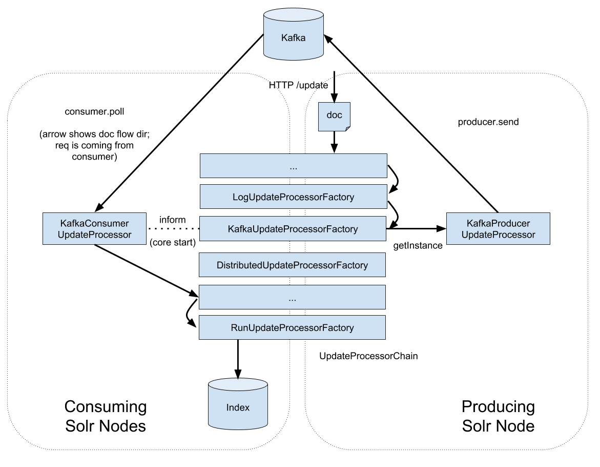

## Goal
Instead of pushing updates to Solr, and forwarding them on to the replicas, send the updates in Kafka,
and have each replica (including the "leader") pull the updates from the queue.

This is currently a **proof-of-concept** plugin for SolrCloud 7.3+ that shows the feasibility of the
idea, and to encourage deeper upstream support.


**Benefits**

- All replicas independently tail the log for updates.  No coordination needed in Solr.
- Automatic update batching on the consumer side for efficiency.
- Configurable QoS for updates vs queries by sizing the consumer pool.
  Currently they compete for the same resources
- Leadership isn't important, any replica can process an update by simply sending it to the queue.
  There is no need to elect a leader.  Ideally:
  - No LIR
  - No PeerSync
  - No Overseer leadership state processing
  - No "ClusterState says we are the leader, but locally we don't think so"

The project doesn't currently prevent change the leader election, but it does
avoid leadership checking during update processing.


## Requirements and Constraints
- Solr 7.3+ (requires `scheduled` trigger)
- Collections use the `compositeId` router, no implicit sharding
- Does not support `SPLITSHARD` (yet)
- Atomic updates, if failing due to version constraints, will fail asynchronously in the consumer,
  not synchronously fail (409) in the http /update request.  Therefore the client making the update
  request will not be informed.

## Supported Features
- update / atomic update
- delete by id / query / query with route
- bypass kafka on a per-update basis (for phasing in/out)
- configurable replication factor for created topics

## Document flow


## Demo
```
# downloads a local copy of:
#  solr 7.5, zookeeper 3.5.3, kafka-2.0
# builds the plugin, installs with deps under solr server WEB-INF
# alters the solrconfig to include the UpdateProcessor
# starts a 1-node zk cluster
# starts a 2-node kafka cluster under /kafka zk chroot
# starts a 2-node solr cluster

make start

# installs the scheduled overseer trigger.  this
# watches for added/removed collections and creates
# the corresponding kafka topics with a partition per shard
make solr-trigger
```


## Adding the plugin manually

### Step 0: Build It, add libs to your Solr install
```
make build
cp target/solr_kafka-7.5.0.jar \
  /path/to/kafka-clients-2.0.0.jar \ # kafka client
  /path/to/lz4-java-1.4.1.jar \      # kafka client dep
  /path/to/snappy-java-1.1.7.1.jar \ # kafka client dep
  $SOLR_HOME/server/solr-webapp/webapp/WEB-INF/lib
```

### Step 1: Add the UpdateProcessor to solrconfig.xml

Add this line _right above_ solr.DistributedUpdateProcessorFactory:

```
<processor class="com.github.solrqueue.solrkafka.KafkaUpdateProcessorFactory">

  <!-- where to find your kafka servers -->
  <str name="bootstrap.servers">localhost:9093,localhost:9094</str>

  <!-- name of field on each solr doc to store kafka offset, must be a docValues plong -->
  <str name="field">_offset_</str>

</processor>
```

### Step 2: Add the KafkaTopicSync trigger

You don't want to have producers dynamically creating kafka topics, because you can't specify the
correct number of partitions (shards) by default when a topic is dynamically created.  It is best if
there is just one entity in your cluster whose job is to sync the Solr's clusterstate with Kafka's
topic + partition.  The natural place for this is the overseer. The
[scheduled trigger](https://lucene.apache.org/solr/guide/7_3/solrcloud-autoscaling-triggers.html) c
an run can run the sync check every N seconds.  N determines how quickly a topic is writable after
collection creation.

```
curl -s "localhost:8983/solr/admin/autoscaling" \
  -HContent-Type:application/json \
  -d@trigger.json
```


### Step 3: Fine tuning

- You'll probably want to use a separate kafka cluster for this, since the automated trigger will be
  in charge of the topics and partitions in the cluster.

**Broker Config**

- You should set `auto.create.topics.enable=false` so that producers reject updates before the topic
  as been properly created.

**Trigger Config**

- You should configure `replication.factor` in your trigger.json file to set your desired kafka
  replication factor (not related to number of Solr replicas).


**KafkaUpdateProcessorFactory Config**

- Set `producer.linger.ms` to somthing greater than 0 ms (default) to send updates to kafka in batch.
  Note that this slows the /update HTTP response to wait for other requests.
- Configure timeouts like `producer.request.timeout.ms` or `producer.max.block.ms` to define how
  Solr's update handler responds when it cannot send updates to kafka.  By default it responds in
  30 seconds with a 500 if it cannot reach kafka.
